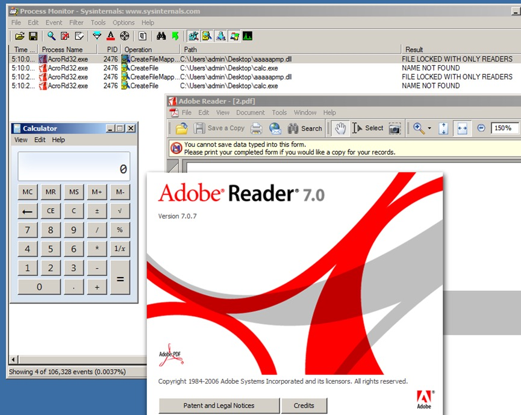
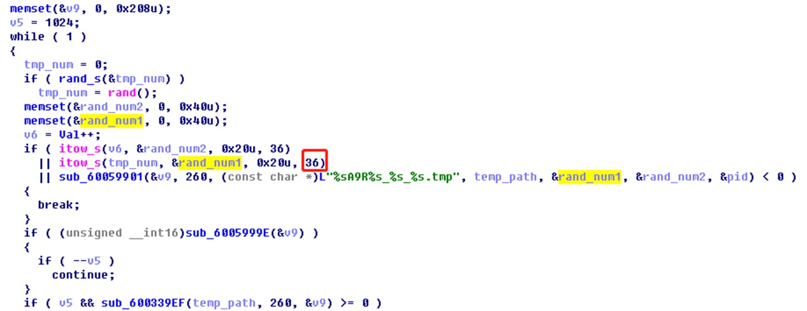

## AdobeReader 逻辑漏洞(CVE-2021-21037)
> 360漏洞研究院 王志远 发布于 2022-08-17 03:17

### 漏洞描述

Acrobat Reader DC 版本 2020.013.20074（及更早）、2020.001.30018（及更早）和 2017.011.30188（及更早）受路径遍历漏洞影响。未经身份验证的攻击者可以利用此漏洞在当前用户设备中执行任意代码。

### 影响范围

Acrobat Reader DC versions versions 2020.013.20074 (and earlier), 2020.001.30018 (and earlier) and 2017.011.30188 (and earlier)

### 漏洞详情

#### 漏洞位置

该漏洞为组合漏洞，其中：

1. DLL 加载逻辑漏洞位于XFA模块中，解析XFA语句的barcode类型type属性时，没有校验是否支持该barcode属性，直接尝试加载输入的值，导致任意DLL加载漏洞。
2. DLL 释放逻辑漏洞在创建“PDF包”的功能中(可创建包含任意类型的附件,并在预览时，释放至%temp%目录)

#### 漏洞触发条件

上述两个漏洞组合即可完成一次远程任意代码执行漏洞利用。（需用户点击打开恶意 pdf）

#### 漏洞原理

1. DLL 加载逻辑漏洞位于XFA模块中，解析XFA语句的barcode类型type属性时，没有校验是否支持该barcode属性，直接尝试加载输入的值，导致任意DLL加载漏洞。
2. DLL 释放逻辑漏洞在创建“PDF包”的功能中(可创建包含任意类型的附件,并在预览时，释放至%temp%目录)

### poc/exp

#### DLL加载逻辑漏洞分析
我们在挖掘AdobeReader时发现一个DLL加载的逻辑漏洞，该漏洞位于XFA模块中，在解析XFA语句的barcode类型type属性时，没有校验是否支持该barcode属性，直接尝试加载输入的值，导致任意DLL加载漏洞。该漏洞从2006年至2021年初修复，POC无需做任何修改，期间无差别运行长达15年之久。POC如图1：

运行POC并使用Process Monitor监控会发现：AdobeReader会尝试加载当前目录下的aaaaapmp.dll。如果输入值为\xxx.xxx.xxx.xxx\aaaaa时，则会加载远程IP共享目录下的DLL，如果输入值为c:\windows\aaaaa时，则会加载系统目录中的DLL。但是有一个限制是：AdobeReader在执行LoadLibrary之前，会执行类似strcpy(in_type, “pmp”)的语句，导致LoadLibrary目标文件的后缀只能是pmp.dll。

#### DLL释放逻辑漏洞分析

有了任意DLL加载漏洞之后，我们还缺少一个DLL释放的漏洞，AdobeAcrobat存在创建“PDF包”的功能，可以添加任意类型的附件到PDF中，并且可以在PDF中可以预览该附件，在预览时，该附件会被自动释放到%temp%目录下的随机目录中。我们使用这个方法将制作好的DLL添加到PDF中，使用JavaScript脚本释放到用户目录下的%temp%目录中，然后用barcode任意DLL加载漏洞执行%temp%目录下释放出来的DLL文件，由于目录名称是随机的，我们还需要分析一下随机目录的生成方式。PDF释放文件时，会在%temp%目录中创建随机目录并写入，随机目录生成代码位于sub_60059740函数，代码片段如图4。

首先了解一下Windows短路径名命名规则：主文件名的长度如果超过了8个，系统自动截取前6个字符，然后加上~1。从代码中可以观察到随机目录生成格式为A9R+随机字符串+随机字符串+PID，由于A9R的存在，可以使用Windows短路径的方式遍历出这个目录，总共需要遍历4万多个路径，经过测试，触发时间大约10多分钟，但达不到我们的想要的速度。

#### 挖掘随机数转换逻辑漏洞
我从上述代码中发现了一个有意思的地方，随机数转换为字符串时使用itow()函数，并且参数设置为36进制，在使用itow将数值转换为36进制字符串时存在一个概率问题：转换后的随机路径第一位数有51%概率为“1”，0%概率为“0”，其他值为1%概率。如下图是我用C语言复现了AdobeReader使用itow()函数的转换方式，统计并打印出第一位随机数的概率。

将此逻辑漏洞在AdobeReader中实践可以观察到：释放一次文件，有51%概率目录开头为A9R1，释放多次之后，生成开头为A9R1的目录概率约为100%。此时我们已经确定了Windows短路径的前4位内容，再遍历剩下2位路径，只需1000次遍历就可以在10秒左右加载指定DLL。

### 漏洞修复建议

官方已修复，相关用户升级补丁即可。
https://helpx.adobe.com/security/products/acrobat/apsb21-09.html