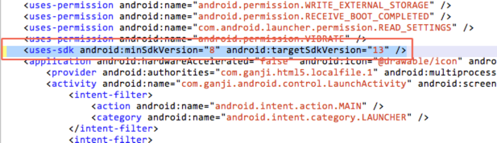
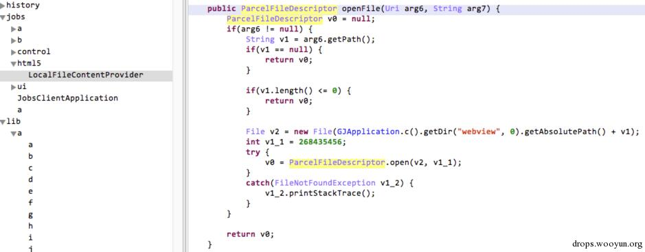
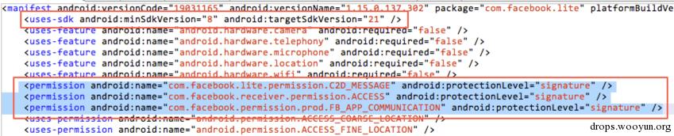
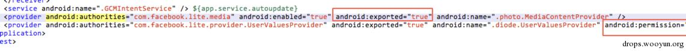
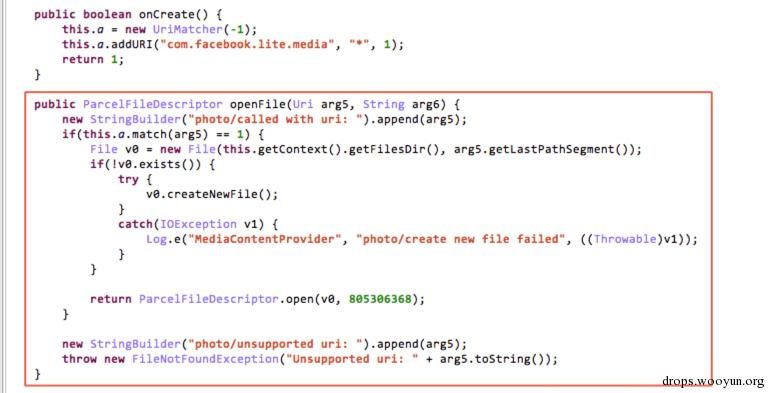
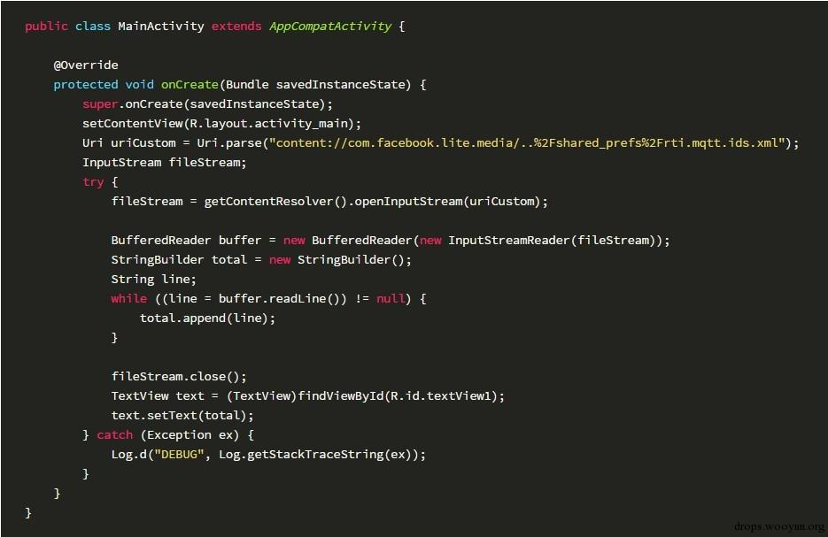
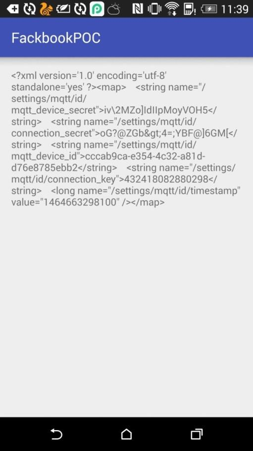

## Content Provider文件目录遍历漏洞
> 阿里无线安全团队发表于2015年03月11日

### 漏洞描述

Android Content Provider存在文件目录遍历安全漏洞，该漏洞源于对外暴露Content Provider组件的应用，没有对Content Provider组件的访问进行权限控制和对访问的目标文件的Content Query Uri进行有效判断，攻击者利用该应用暴露的Content Provider的openFile()接口进行文件目录遍历以达到访问任意可读文件的目的。

#### google 官方描述

在导出的 ContentProviders 中实现 openFile 时，如果不能正确验证传入的 URI 参数，就可能存在安全漏洞。

恶意应用可能会提供精心伪装的 URI（例如，包含“/../”的 URI），诱使您的应用为既定目录之外的文件返回 ParcelFileDescriptor，从而允许恶意应用访问您的应用可访问的任何文件。

### 影响范围

几乎 Android 所有系统

### 漏洞详情

#### 漏洞位置

```java
ContentProvider.openFile(Uri uri, String mode)
```

#### 漏洞触发条件

对外暴露的Content Provider组件实现了openFile()接口；

没有对所访问的目标文件Uri进行有效判断，如没有过滤限制如“../”可实现任意可读文件的访问的Content Query Uri，应用为既定目录之外的文件返回 ParcelFileDescriptor，从而允许恶意应用访问您的应用可访问的任何文件。

#### 漏洞原理

对外暴露的Content Provider实现了openFile()接口，因此其他有相应调用该Content Provider权限的应用即可调用Content Provider的openFile()接口进行文件数据访问。

但是如果没有进行Content Provider访问权限控制和对访问的目标文件的Uri进行有效判断，攻击者利用文件目录遍历访问任意可读文件。 

### poc/exp

#### 例子1 以乌云公开漏洞wooyun-2013-044407为例：

此APP实现中定义了一个可以访问本地文件的Content Provider组件，为com.ganji.android.jobs.html5.LocalFileContentProvider，因为使用了minSdkServison为“8”，targetSdkVersion=”13”，即此Content Provider采用默认的导出配置，即android:exported=”true”：



该Provider实现了openFile()接口：



通过此接口可以访问内部存储app_webview目录下的数据，由于后台未能对目标文件地址进行有效判断，可以通过”../”实现目录遍历，实现对任意私有数据的访问。

 

例子2 
某社交应用客户端，使用了的minSDKVersion为8，定义了私有权限，并且android:protectionLevel设为了signature



有一个对外暴露的Content Provider，即com.facebook.lite.photo.MediaContentProvider，此Provider没有设置访问权限，而另外一个Provider是设置了访问权限的：



在MediaContentProvider中实现了openFile()接口，没有对传入的URI进行限制和过滤：



此接口本来只想让用户访问照片信息的，但是却可以突破限制，读取其他文件： 
POC：




读取到其他文件的内容为：



另外看到Openfile()接口的实现中，如果要访问的文件不存在，就会创建此文件，还有可能的风险就是在应用的目录中写入任意文件。
 

### 漏洞修复建议

1. 将不必要导出的Content Provider设置为不导出
      由于Android组件Content Provider无法在Android 2.2（即API Level 8）系统上设为不导出，因此如果应用的Content Provider不必要导出，阿里聚安全建议声明最低SDK版本为8以上版本；
      由于API level 在17以下的所有应用的“android:exported”属性默认值都为true.，因此如果应用的Content Provider不必要导出，阿里聚安全建议显示设置注册的Content Provider组件的“android:exported”属性为false；
2. 去除没有必要的openFile()接口
    如果应用的Content Provider组件没有必要实现openFile()接口，阿里聚安全建议移除该Content Provider的不必要的openFile()接口。
3. 过滤限制跨域访问，对访问的目标文件的路径进行有效判断[7] 
      使用Uri.decode()先对Content Query Uri进行解码后，再过滤如可通过“../”实现任意可读文件的访问的Uri字符串；
4. 设置权限来进行内部应用通过Content Provider的数据共享[6] 
      使用签名验证来控制Content Provider共享数据的访问权限：设置protectionLevel=”signature”；

#### google 官方建议

建议您采取以下两种策略来消除 ContentProvider 中的路径遍历安全漏洞。

1. 如果您的 ContentProvider 无需向其他应用提供资料，请执行以下操作：
您可以在清单中修改受影响的 ContentProvider 的 \<provider\> 标记，以便设置 android:exported=”false”。此操作将阻止其他应用将 Intent 发送到受影响的 ContentProvider。
您还可以设置 android:permission 属性，将 permission 设为 android:protectionLevel=“signature”，以防止其他开发者编写的应用将 Intent 发送到受影响的 ContentProvider。
2. 如果您的 ContentProvider 需要向其他应用提供资料，请执行以下操作：

您必须确保对 openFile（包含路径遍历字符）的输入，不会造成您的应用返回非预期文件。做法是检查文件的规范路径。例如：

public ParcelFileDescriptor openFile (Uri uri, String mode)
   throws FileNotFoundException {
 File f = new File(DIR, uri.getLastPathSegment());
 if (!f.getCanonicalPath().startsWith(DIR)) {
   throw new IllegalArgumentException();
 }
 return ParcelFileDescriptor.open(f, ParcelFileDescriptor.MODE_READ_ONLY);
}
 
注意事项：

*使用 URI 参数调用 getLastPathSegment 并不安全，因为恶意应用可能会提供一个经过编码的 URI 路径，例如 %2F..%2F..path%2Fto%2Fsecret.txt，因此 getLastPathSegment 的结果将是 /../../path/to/secret.txt。例如，实施以下代码仍会使您的应用容易受到攻击。*

```java
public ParcelFileDescriptor openFile(Uri uri, String mode){
 File f = new File(DIR, uri.getLastPathSegment());
 return ParcelFileDescriptor.open(f, ParcelFileDescriptor.MODE_READ_ONLY);
}
```