## Content Provider任意数据访问漏洞
> 阿里聚安全发布于 2016-06-02

### 漏洞描述
	
ContentProvider的权限没有做好控制，可能导致APP的敏感数据泄露

content URI是一个标志provider中的数据的URI。Content URI中包含了整个provider的以符号表示的名字(它的authority)和指向一个表的名字(一个路径)。

当调用一个客户端的方法来操作一个 provider 中的一个表，指向表的contentURI是参数之一，如果对ContentProvider的权限没有做好控制，就有可能导致恶意的程序通过这种方式读取APP的敏感数据。

### 影响范围

近乎 Android 所有系统

### 漏洞详情

#### 漏洞位置

```xml
<provider android:name=".providers.XXXProvider" android:process="com.xxx.yyyy" android:authorities="com.xxx.yyyy.providers.DataStructs"/>
```

#### 漏洞触发条件

Content Provider 对外导出；定义了私有权限，但是却根本没有定义私有权限的级别，或者定义的权限级别不够，导致恶意应用只要声明这个权限就能够访问到相应的Content Provider提供的数据，造成数据泄露。

#### 漏洞原理

content uri是一个标志provider中的数据的URI。content uri中包含了整个provider的以符号表示的名字（authority）和指向一个表的名字（路径）。

当调用一个客户端的方法来操作一个provider的表，指向表的content uri是参数之一。

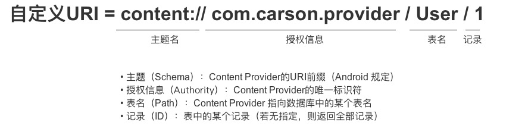

```markdown
1. content:// : 作为 content Uri的特殊标识(必须);

2. 权(authority) : 用于唯一标识这个Content Provider，外部访问者可以根据这个标识找到它；在AndroidManifest中也配置的有；

3. 路径(path) : 所需要访问数据的路径，根据业务而定。
```

如果对Content Provider的权限没有做好控制， 比如定义了私有权限，但是却根本没有定义私有权限的级别；或者定义的权限级别不够， 就有可能导致恶意的程序通过这种方式读取APP的敏感数据。

### poc/exp

#### 例子1 公开的乌云漏洞WooYun-2014-57590：
某网盘客户端使用了自己的私有权限，但是在AndroidManifest中却没有定义私有权限，其它APP只要声明这个权限就能访问此网盘客户端提供的Provider，从而访问到用户数据。

在网盘客户端的AndroidManifest中注册Provider时，声明了访问时需要的读写权限，并且权限为客户端自定义的私有权限：

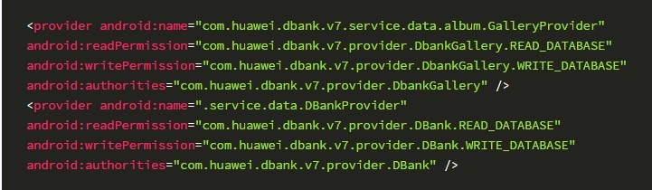

但是在AndroidManifest中却没有见到私有权限“com.xxxx.dbank.v7.provider.DBank.READ_DATABASE”和“com.xxxx.dbank.v7.provider.DBank.WRITE_DATABASE”的定义：

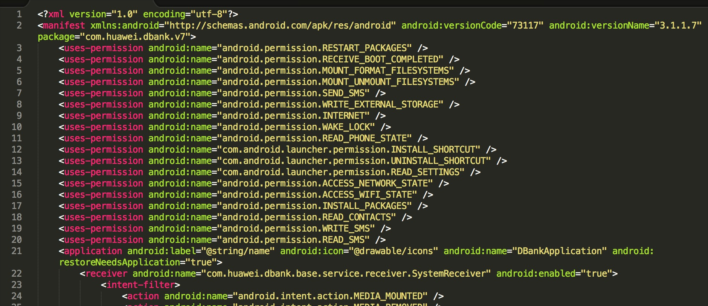

反编译客户端后查看到的URI，根据这些可以构造访问到Provider的URI：

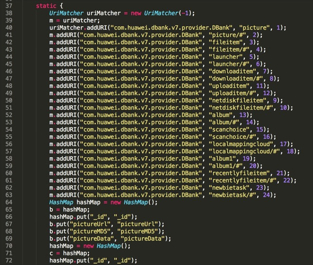

编写POC
以查看网盘下载的文件列表为例，
在POC的AndroidManifest中声明私有权限，权限的保护级别定义为最低级“normal”：

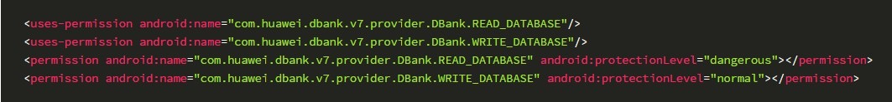

主要代码为：

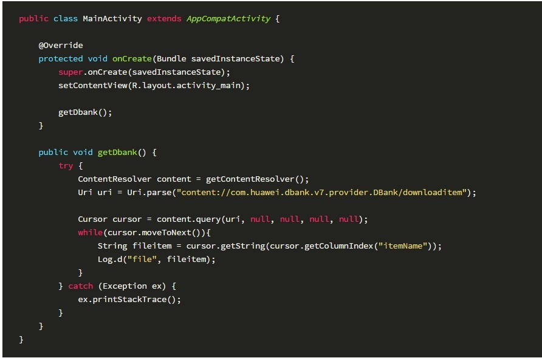

拿到数据库中保存的下载列表数据：

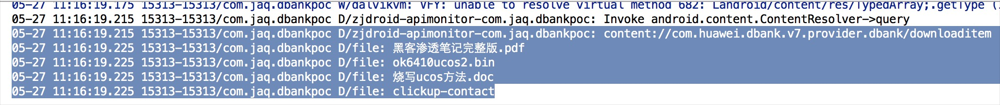

对应的数据库：

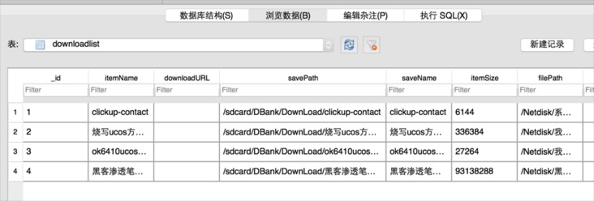

这样任意的恶意应用程序就可以访问到用户网盘的上传、下载记录，网盘里面存的文件列表等隐私信息。

#### 例子2 公开的乌云漏洞wooyun-2013-039697：

定义了私有权限，但是保护等级设置成为了dangerous或者normal，这样的保护等级对于一些应用的Provide重要性相比保护级低了。

Provider为：

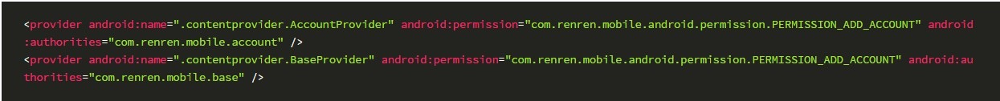

私有权限“com.renren.mobile.android.permission.PERMISSION_ADD_ACCOUNT”的定义为：

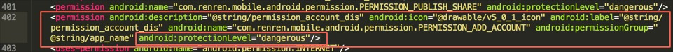

反编译客户端，看到AcountProvider对应的实现：

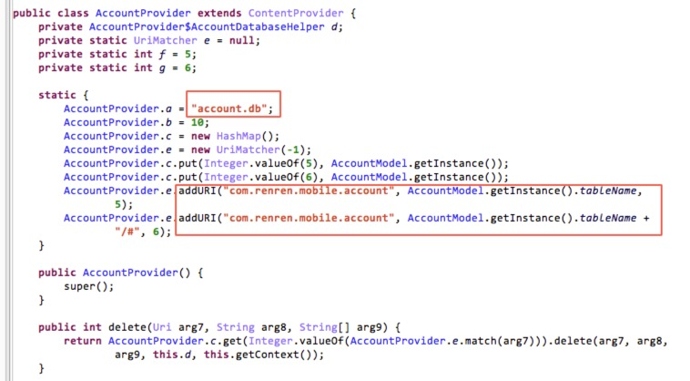

编写POC：

在AndroidManifest中定义和声明权限：

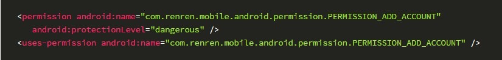

主要代码为：

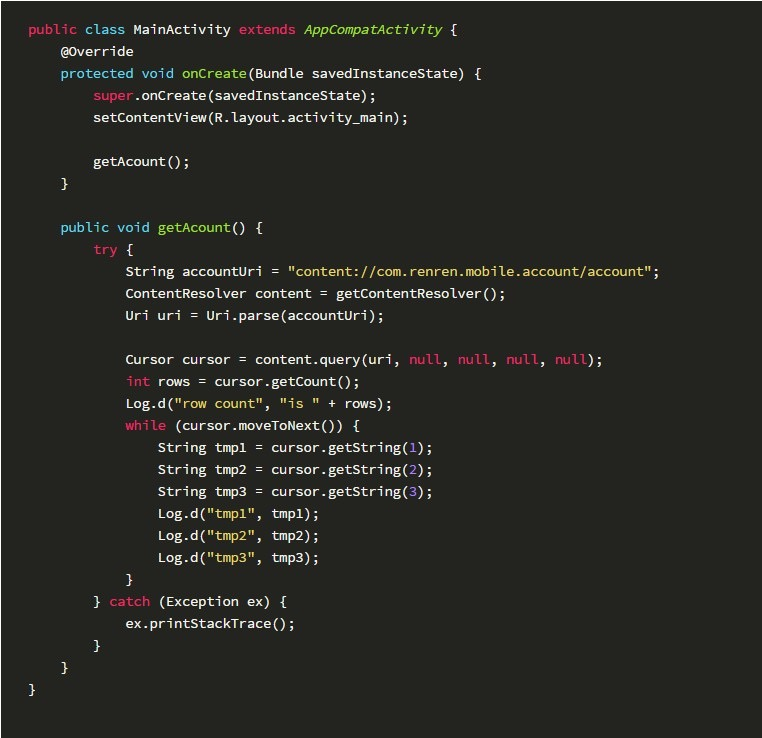

可看到用户的账户信息，包括uid，手机号，加密后的密码等：

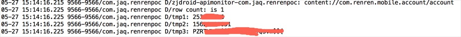


### 漏洞修复建议

1. minSdkVersion不低于9
2. 不向外部app提供数据的私有content provider显示设置exported=”false”，避免组件暴露(编译api小于17时更应注意此点)
3. 内部app通过content provid交换数据时，设置protectionLevel=”signature”验证签名
4. 公开的content provider确保不存储敏感数据