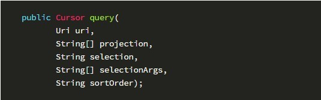
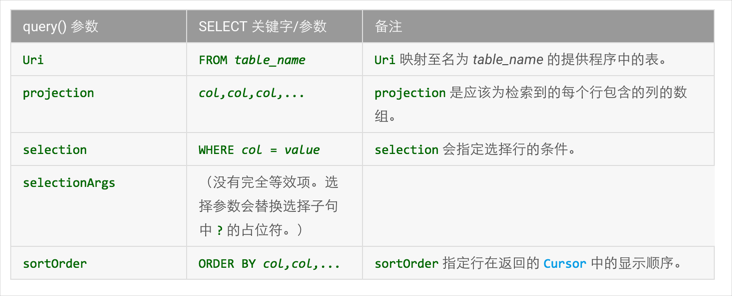
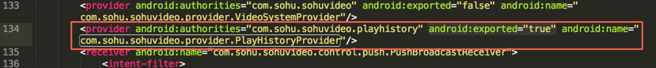
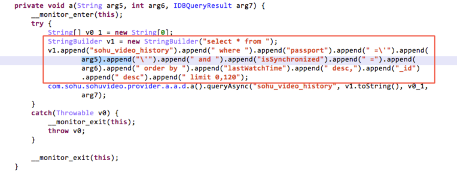
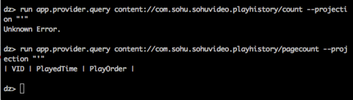

## Content Provider SQL注入漏洞
> 阿里聚安全发布于 2016-06-02

### 漏洞描述

当Content Provider的数据源是SQLite数据库时，如果实现不当，而Provider又是暴露的话，则可能会引发本地SQL注入漏洞。

### 影响范围

几乎 Android 所有系统

### 漏洞详情

#### 漏洞位置

```smali
Landroid/content/ContentProvider;->query(Landroid/net/Uri;[Ljava/lang/String;Ljava/lang/String;[Ljava/lang/String;Ljava/lang/String;)Landroid/database/Cursor;
```

#### 漏洞触发条件

1. 定位ContentProvider组件对应的子类. （对应到smali语句中的特征）

```smali
.super Landroid/content/ContentProvider;
```

2. 判断Provider是否对外暴露（exported属性为true）

3. 判断子类中是否调用query方法
```smali
->query(Landroid/net/Uri;[Ljava/lang/String;Ljava/lang/String;[Ljava/lang/String;Ljava/lang/String;)Landroid/database/Cursor;
```
4. 找到projection，selection参数对应的寄存器名称 v1
5. 判断寄存器V1的赋值来源是否为拼接字符串


#### 漏洞原理

当Content Provider的数据源是SQLite数据库时，如果实现不当，而Provider又是暴露的话，则可能会引发本地SQL注入漏洞。
Content Provider的query()的方法定义为：



其中参数：

```markdown
uri:为content Uri，要查询的数据库
projection：为要查询的列名
selection和selectionArgs：要指定查询条件
sortOrder：查询结果如何排序
query() 与 SQL 查询对比如下：
```



如果query()中使用的是拼接字符串组成SQL语句的形式去查询底层的SQLite数据库时，容易发生SQL注入。

### poc/exp

#### 例子1 乌云公开漏洞wooyun-2016-0175294：
客户端的com.sohu.sohuvideo.provider.PlayHistoryProvider的exported属性为“true”：


反编译客户端，追踪PlayHistoryProvider的实现，发现是用拼接字符串形式构造原始的SQL查询语句：


使用drozer工具，证明漏洞：


### 漏洞修复建议
1. 不必要导出的Provider组件，建议显示设置组件的“android:exported”属性为false
2. 使用selectionArgs进行参数化查询