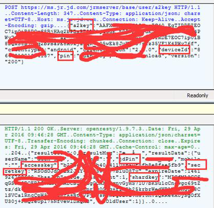
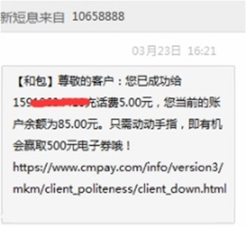

## Https中间人攻击漏洞
> **发表于2017-08-01

### 漏洞描述

中间人攻击，Man-in-the-middle attack，缩写：MITM，是指攻击者与通讯的两端分别创建独立的联系，并交换其所收到的数据，使通讯的两端认为他们正在通过一个私密的连接与对方直接对话，但事实上整个会话都被攻击者完全控制。

### 影响范围

几乎 Android 所有系统

### 漏洞详情
#### 漏洞位置

1. checkClientTrusted中没有检查证书是否可信
```java
@Override
public void checkClientTrusted(X509Certificate[] chain, String authType){
}
```

2. 实现HostnameVerifier时，没有在verify中进行严格证书校验
```java
HostnameVerifier hv = new HostnameVerifier(){
@Override
public boolean verify(String hostname,SSLSession session){
return true;
}
}
```

3. setHostnameVerifier方法中使用ALLOW_ALL_HOSTNAME_VERIFIER，信任所有Hostname
```java
SSLSocketFactory sf;
......
sf.setHostnameVerifier(SSLSocketFactory.ALLOW_ALL_HOSTNAME_VERIFIER)
```

#### 漏洞触发条件

1. 在自定义实现X509TrustManager时，checkServerTrusted中没有检查证书是否可信，导致通信过程中可能存在中间人攻击，造成敏感数据劫持危害。

2. 在重写WebViewClient的onReceivedSslError方法时，调用proceed忽略证书验证错误信息继续加载页面，导致通信过程中可能存在中间人攻击，造成敏感数据劫持危害。

3. 在自定义实现HostnameVerifier时，没有在verify中进行严格证书校验，导致通信过程中可能存在中间人攻击，造成敏感数据劫持危害。

4. 在setHostnameVerifier方法中使用ALLOW_ALL_HOSTNAME_VERIFIER，信任所有Hostname，导致通信过程中可能存在中间人攻击，造成敏感数据劫持危害。

#### 漏洞原理

由于客户端没有校验服务端的证书，因此攻击者就能与通讯的两端分别创建独立的联系，并交换其所收到的数据，使通讯的两端认为他们正在通过一个私密的连接与对方直接对话，但事实上整个会话都被攻击者完全控制。在中间人攻击中，攻击者可以拦截通讯双方的通话并插入新的内容。

### poc/exp

#### 例子1 京东金融MITM漏洞

京东金融Ver 2.8.0由于证书校验有缺陷，导致https中间人攻击，攻击者直接可以获取到会话中敏感数据的加密秘钥，另外由于APP没有做应用加固或混淆，因此可以轻松分析出解密算法，利用获取到的key解密敏感数据。

如下是登陆过程中捕获到的数据：



其中的secretkey用于加密后期通信过程中的敏感数据，由于APP中使用的是对称加密，攻击者可以还原所有的通信数据。

#### 例子2 中国移动和包任意消费漏洞

HTTPS证书校验不严格，可被MITM；

加密算法不安全，可被破解；

关键数据保存在sdcard卡上，可被任意访问；

代码混淆度低，业务逻辑，关键数据泄漏；

消息签名算法比较简单，数据可被修改；

通信数据如下：
```html
POST https://mca.cmpay.com:28710/ccaweb/CCLIMCA4/2201194.dor HTTP/1.1

Cookie: JSESSIONID=CHGmYSZLTMRAx_1sSEuUP6Q4vmRI9gWiRPM6ANGnH7eZWv0NhErE!221531807

.......

Content-Length: 521

Host: mca.cmpay.com:28710

Connection: Keep-Alive

Cookie: JSESSIONID=CHGmYSZLTMRAx_1sSEuUP6Q4vmRI9gWiRPM6ANGnH7eZWv0NhErE!221531807

Cookie2: $Version=1

<?xml version="1.0" encoding="UTF-8" ?><ROOT><HEAD><IMEI>866697029909260</IMEI><MCID>201603241008185gye5tKk6EPB4iliO7</MCID><TXNCD>2201194</TXNCD><VERSION >4.3.82</VERSION ><UA>Android_21-1794*1080-HUAWEI GRA_UL10</UA><SOURCE>2009</SOURCE><PLAT>3</PLAT><DEVID>CAS00016</DEVID><SERLNO>991</SERLNO></HEAD><BODY><IMEI>866697029909260</IMEI><ENTRY>10</ENTRY><MAC>50:a7:2b:c5:e2:d8</MA
```
在用户开启免密支付的前提下，结合以上安全问题，可以实现本地或远程攻击，直接盗取和包用户资金，如给任意账号充值等，给用户带来直接经济损失。



### 漏洞修复建议

1. 建议自定义实现X509TrustManager时，在checkServerTrusted中对服务器信息进行严格校验
2. 在重写WebViewClient的onReceivedSslError方法时，避免调用proceed忽略证书验证错误信息继续加载页面
3. 在自定义实现HostnameVerifier时，在verify中对Hostname进行严格校验
4. 建议setHostnameVerifier方法中使用STRICT_HOSTNAME_VERIFIER进行严格证书校验，避免使用ALLOW_ALL_HOSTNAME_VERIFIER