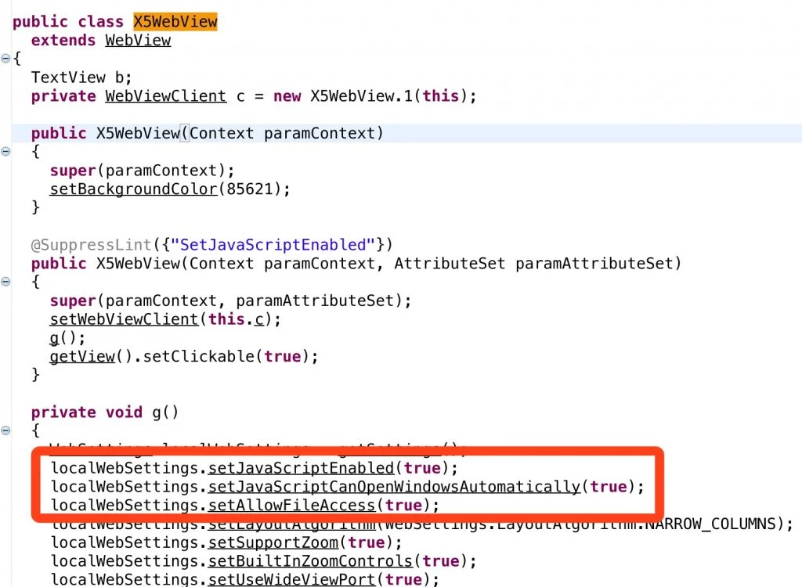
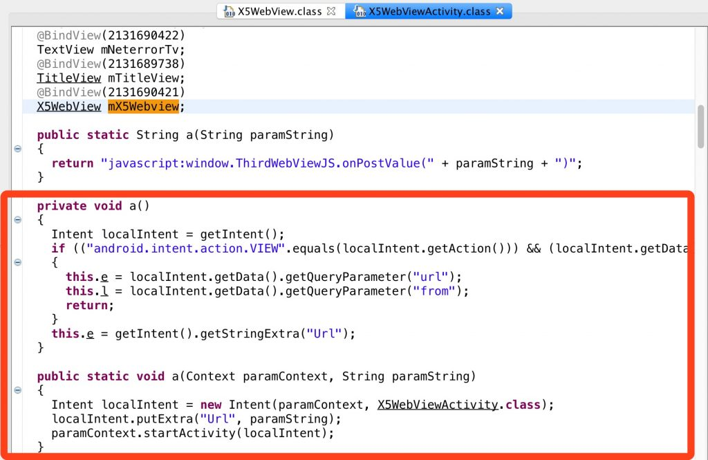
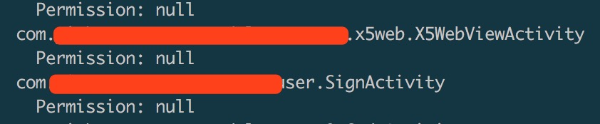

## Android WebView跨域访问漏洞(CNVD-2017-36682)
> 腾讯玄武实验室 2017年12月7日

### 漏洞描述

Android WebView存在跨域访问漏洞。该漏洞产生的原因是由于Android应用WebView开启了file域访问，且允许file域访问http域，未对file域的路径做严格限制所致。攻击者可以利用漏洞，远程获取APP中的所有本地敏感数据。

### 影响范围

漏洞影响使用WebView控件，开启file域访问并且未按安全策略开发的Android应用APP。

### 漏洞详情
#### 漏洞位置

```java
public class WebViewActivity extends Activity {
    private WebView webView;
    public void onCreate(Bundle savedInstanceState) {
        super.onCreate(savedInstanceState);
        setContentView(R.layout.activity_webview);
        webView = (WebView) findViewById(R.id.webView1);
        //webView.getSettings().setAllowFileAccess(false);                 (1)
        //webView.getSettings().setJavaScriptEnabled(true);                (2)
        //webView.getSettings().setAllowFileAccessFromFileURLs(true);      (3)
        //webView.getSettings().setAllowUniversalAccessFromFileURLs(true); (4)
        Intent i = getIntent();
        String url = i.getData().toString();
        webView.loadUrl(url);
    }
 }
```
#### 漏洞触发条件

1. WebView中setAllowFileAccessFromFileURLs 或setAllowUniversalAccessFromFileURLsAPI配置为true；

2. WebView可以直接被外部调用，并能够加载外部可控的HTML文件。


#### 漏洞原理

在Android应用中，WebView开启了file域访问，允许file域访问http域，且未对file域的路径进行严格限制所致。攻击者通过URL Scheme的方式，可远程打开并加载恶意HTML文件，远程获取APP中包括用户登录凭证在内的所有本地敏感数据。

### poc/exp

#### 例子 1 某个app

1. 如图X5WebView类继承了webview类，并且设置了允许file协议，以及启用了javascript执行;



2. 再看看使用该X5Webview类的Activity，发现URL是从intent传递的对象中获取的，并且没有做任何白名单处理，直接启动了Activity;



3. 并且发现该activity是可导出的，如图：



基于以上三点，攻击者可以用恶意链接实现生成本地恶意攻击html，并传递恶意html的file路径给可导出的组件，该组件加载访问html文件执行其中的恶意js，会导致私有目录中的文件被攻击者获取。

### 漏洞修复建议

1. file域访问为非功能需求时，手动配置setAllowFileAccessFromFileURLs或setAllowUniversalAccessFromFileURLs两个API为false。

    （Android4.1版本之前这两个API默认是true，需要显式设置为false，因未找到设置的接口，4.1版本之前暂不做操作，4.1版本后需要防止显示设置为true，如果设置为true的话，防止loadUrl的传参url为可被攻击的）

2. 若需要开启file域访问，则设置file路径的白名单，严格控制file域的访问范围，具体如下：

    - 固定不变的HTML文件可以放在assets或res目录下，file:///android_asset和file:///android_res 在不开启API的情况下也可以访问；
    - 可能会更新的HTML文件放在/data/data/(app) 目录下，避免被第三方替换或修改；
    - 对file域请求做白名单限制时，需要对“../../”特殊情况进行处理，避免白名单被绕过。

3. 避免App内部的WebView被不信任的第三方调用。排查内置WebView的Activity是否被导出、必须导出的Activity是否会通过参数传递调起内置的WebView等。

4. 建议进一步对APP目录下的敏感数据进行保护。客户端APP应用设备相关信息（如IMEI、IMSI、Android_id等）作为密钥对敏感数据进行加密。使攻击者难以利用相关漏洞获得敏感信息。